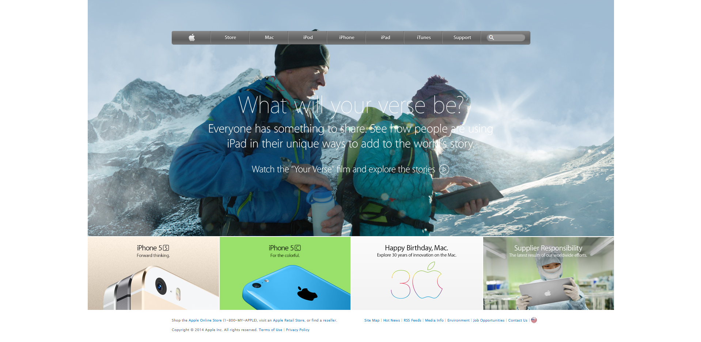

# Apple Homepage Replica

> This project is a clone of an old version of Apple Homepage. It makes use of float, flex and grid CSS display positioning styles. Also the CSS background covers the whole page irrespective of the screen size as a leraning outcome. This solo project is completed as part of the Microverse remote software developement curriculum. Content of the webpage is copied from [that](https://web.archive.org/web/20140301004610/http://www.apple.com/) original page.

## Built With

- HTML,
- CSS

## Live Demo

[Live Demo Link](https://rawcdn.githack.com/SafaErden/Apple-Homepage-Replica/11452ef36c5c4b421c8efc8cc93de5c637d2c87c/index.html)

### Prerequisites

-Any kind of browser suooprting CSS3 and HTML5

### Setup

-Fork the repo to your remote repository.
-Clone or download the repository to your local machine.

### Install

-No istallation needed.

### Usage

-Visit the live demo link on your web browser.

## Author

👤 **Safa ERDEN**

- Github: [@safaerden](https://github.com/SafaErden)
- Twitter: [@safaerden](https://twitter.com/safaerden)
- Linkedin: [SafaErden](https://www.linkedin.com/in/safaerden/)
- Email: [safaerden](mailto:safaerden@gmail.com)

## 🤝 Contributing

Contributions, issues and feature requests are welcome!

Feel free to check the [issues page](https://github.com/SafaErden/Apple-Homepage-Replica/issues).

## Show your support

Give a ⭐️ if you like this project!

## Acknowledgments

- TheOdinProject.com / PROJECT: BUILDING WITH BACKGROUNDS AND GRADIENTS
